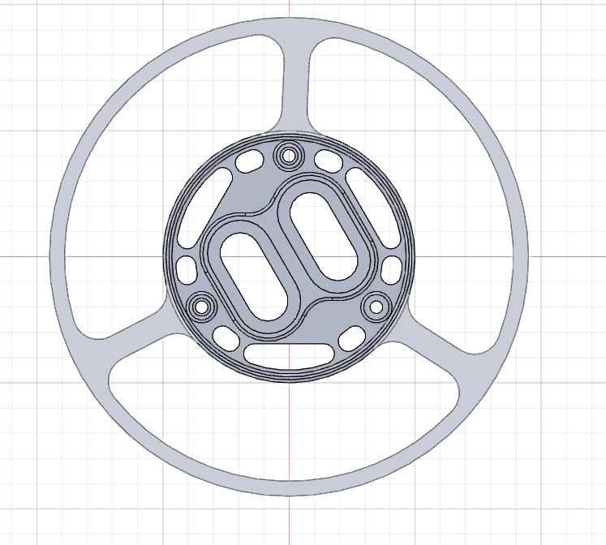
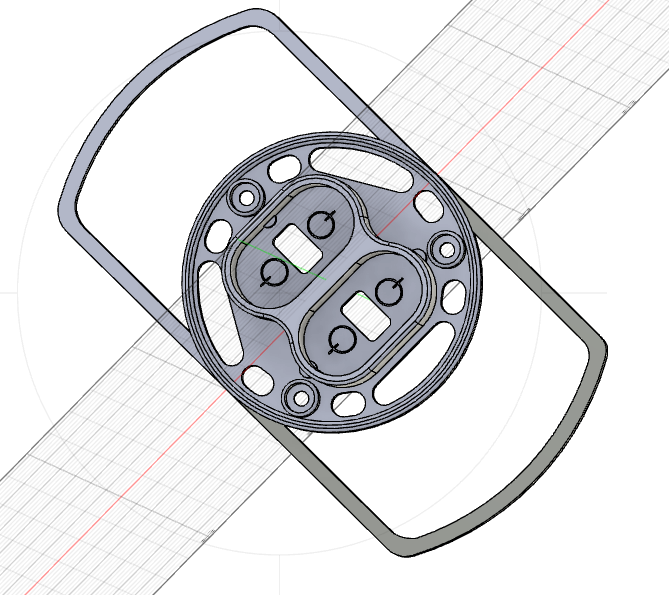

## Edited 3D Model of Balancing Robot
Two components from the original design have been edited to protect the cables and PCBs in the event of a fall.

- The 3D model of the edited top battery holder: [top.STEP](3D%20model%20Balancing%20robot/top.step)  
  

- The 3D model of the edited bottom battery holder: [bot.STEP](bot.step)  
  
