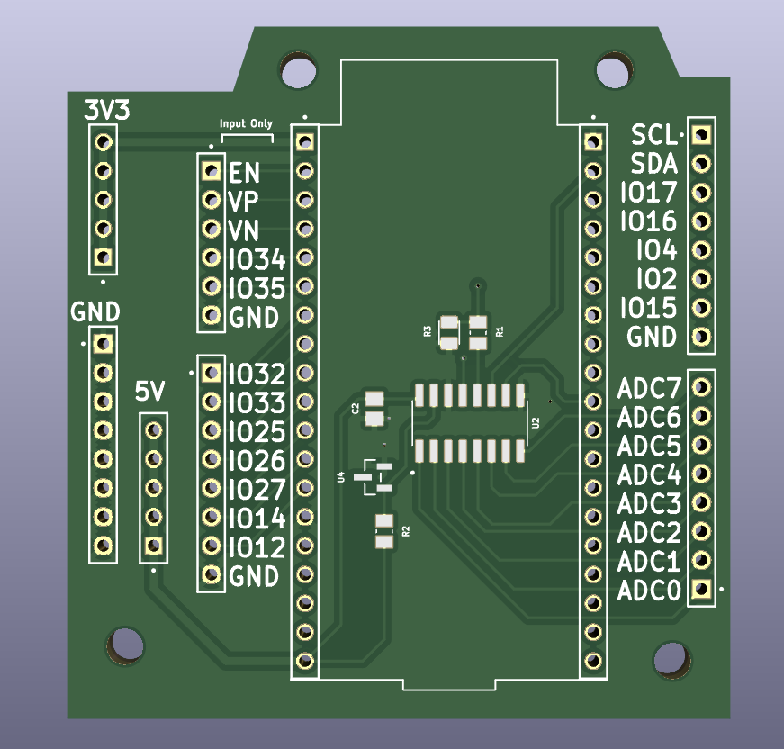
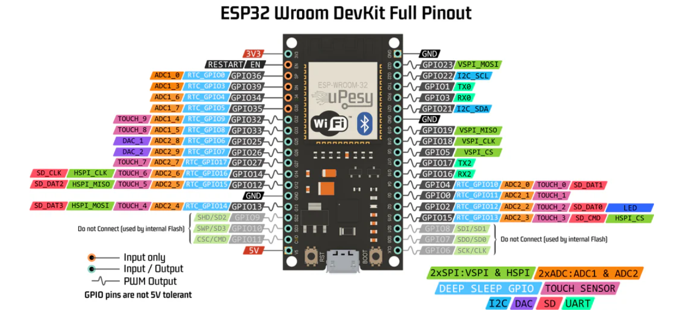

# ESP32 Shield with MCP3208 ADC Chip

This new ESP32 shield integrates an MCP3208 ADC chip, designed with the default SPI pins of the ESP32. Some unusable pins, such as those for UART are removed. The schematic diagram can be seen from [ESP32 schematic](ESP32withmcp3208.pdf).

### GPIO Pin Layout
- **Top Left Corners:** Input-only pins.
- **Bottom Left Corners:** Pins that support the internal ADC of the ESP32.
- **Top Right Corners:** Default I2C communication pins (SCL and SDA) and other GPIO pins.

The default pin configuration for the ESP32 can be seen below:

### Design Files
The complete design files for the shield are available in [ESP32withmcp3208V4.zip](ESP32withmcp3208V4.zip).

### ADC Specs
The voltage reference used in this shield is the LM4040-4.096V reference. The accuracy of this voltage reference varies between 0.1% and 1%, depending on the specific grade of the model. After testing with different power supply values, it was found that an A-grade LM4040 maintains 0.1% accuracy up to a power supply of 4.3V. This makes it suitable for the 5V pin of the ESP32, which typically operates around 4.7V.

Testing on the new sheild with 1V input DC signal and C grade voltage reference, the reading has tolerance around 0.5%. Testing at same condition with a B grade voltage reference, the reading has tolerance around 0.3%, slightly less oscilation. 

### Testing the ADC
You can test the MCP3208 ADC using the provided script: [adctest.ino](adctest.ino).

To test the MCP3208 and MPU6050, which uses SPI and I2C, can using the script:[spiabdi2c](spiandi2c.ino)
