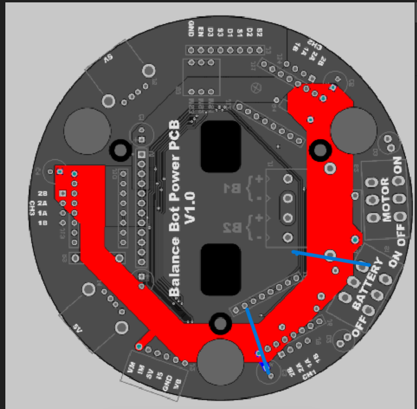
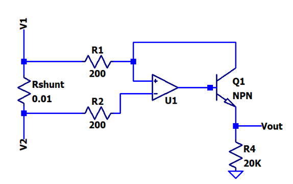
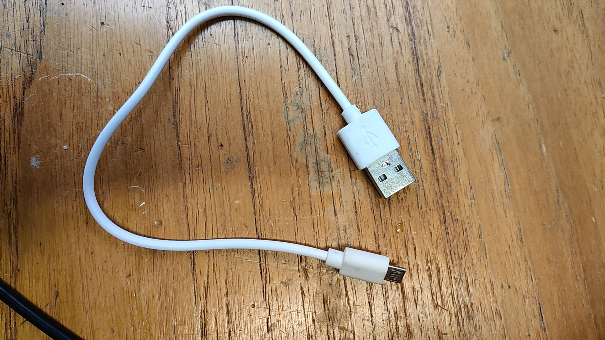

### Voltage drop caused by impedance of the track
For the current sensing task of the balancing robot, a few improvements can be made.

Firstly, the initial power PCB can be seen from the picture below:

The track between Vb and one motor driver (track between the two blue lines) shares the same path with part of the track between the VM pin (for current sensing) and Vb. The impedance of the track causes some voltage drop, which makes the detected voltage drop across the shunt resistor larger than the actual value.

From estimation and testing with a constant supply, the impedance of that part of the path is approximately 0.003 Ohms, which causes around 1.1 mV of voltage drop when testing with a motor that draws 385mA of current at 15V. The values may vary slightly when using different stepper motor settings and with temperature changes.

To solve this problem, one possible solution is to include the voltage drop in the calculation. The resistance of the path is 0.003 ohms, and this is only for one motor driver.

Secondly, different shunt resistor values can be used. After testing with three different resistor values—10mΩ, 50mΩ, and 100mΩ—the voltage drop remains relatively constant. For testing with both motor drivers, the percentage increase in voltage difference is 16.5%, 3.3%, and 1.4%, respectively. (The total current for the drivers differs in each testing condition, possibly due to the temperature of other components on the PCB.) Therefore, a larger resistor could increase accuracy; however, for larger resistor values, the voltage drop across the shunt resistor is higher.

### Potential Issues with Current Sensing Circuits

Some current sensing circuits have a potential risk of unstable performance, which can lead to unintended current flow from the sensing circuit into the main circuit. 

For example, in a BJT current sensing circuit, when the switch is turned on, a small current flows from the Vout pin of the op-amp, potentially causing the BJT to saturate, with both junctions forward biased. This creates a positive feedback loop, causing the output voltage to continuously rise.

To improve this specific circuit, one solution is to use a MOSFET instead of a BJT. A MOSFET is a purely voltage-driven device, and current flows in only one direction across two junctions of the MOSFET. Additionally, using a negative feedback circuit can avoid this problem; swap the V+ and V- inputs and use a PNP transistor instead.

To avoid this problem in general, it is advisable to use the IM pin as the power supply for the current sensing circuit of the motor. In this case, the BJT will only turn on when the second switch is engaged.

However, since there is only one IM pin on the power PCB, using a single wire to connect the PCB to the circuit may cause some voltage drop because the cable carries current for the op-amp's supply. Testing with a jumper wire for the IM pin showed a voltage drop of around 0.1 mV. After amplification, this difference could lead to a larger error. Therefore, it may be beneficial to add an additional IM pin on the PCB.

### Other Causes of Unexpected Results

1. **Grounding**: If the op-amp does not share a common ground with the input pins, current will immediately flow into the PCB for any circuit, including the resistor differential circuit.
   
2. **Selecting the Correct Op-Amp**: The requirements for the op-amp are as follows:
   - The supply voltage range needs to cover at least 14V to 16.8V, which is the range of the battery voltage that decays from 16.8V to around 13V.
   - The op-amp for motor current sensing must have rail-to-rail input since the supply voltage is the same as one of the inputs. It also needs to have a differential common-mode range across the supply range. Some op-amps, such as the LT1637, are labeled as rail-to-rail but only have a differential common-mode range up to 15V. During testing, the output of the LT1637 was lower than expected.
   - It must have low input offset voltage and high CMRR for accuracy.

### Things to Notice When Using Microprocessors

The Raspberry Pi sometimes shows a low voltage warning. After testing with a power supply, it was found that the Raspberry Pi is very sensitive showing the low voltage warning when voltage drops below 5V . This may be caused by:
1. The power source—some laptops have USB outputs that are less than 5V.
2. Using the correct cable—using the AWG28 cable provided in the lab, the voltage drop is around 15mV for the Raspberry Pi with no other sensors, which is very small. However, using other thin cables, such as the one shown below  the voltage drop is larger than 150mV, which may affect the performance of some parts of the board.

Additionally, for the ESP32 board, a diode is used to protect the board, which has a voltage drop of 325mV. If using sensors that run at 5V logic, you need to check the specifications to see if the supply voltage covers 4.6-4.7V. 

Furthermore, both the Raspberry Pi and ESP32 boards run at 3.3V logic, so when choosing components, ensure they have 3.3V output; otherwise, potential dividers may be needed.
