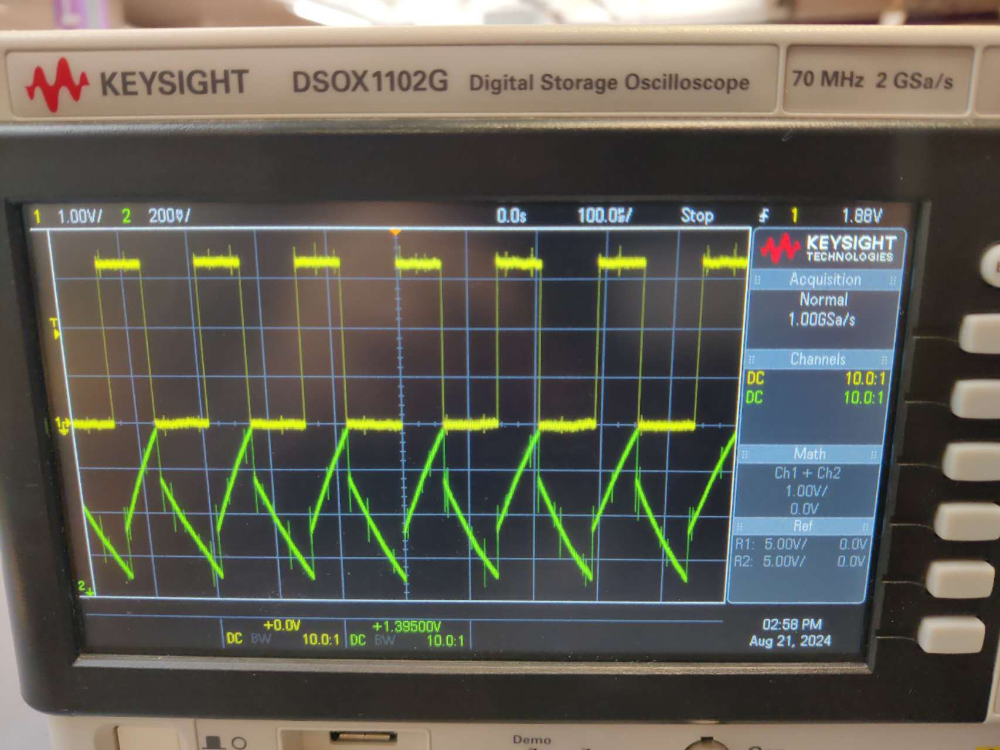

# Touch Pad Oscillator Circuit with Raspberry Pi Control

## Overview of the Task

This project involves creating a circuit that uses a touchpad to influence an oscillator that generates a square wave signal. The circuit’s output frequency changes when the touchpad is touched. The Raspberry Pi, running MicroPython, measures these frequency changes and controls NeoPixel LEDs based on the measurements.

---

## Analog Circuit Explanation
The full circuit design involves 4 touch pads, each touch pad are connected a oscillator circuit below 
. 

### Key Components

- **Schmitt Trigger Inverter**:
  - **Function**: Cleans up the input signal, turning it into a sharp square wave.
  - **Thresholds**:
    - **High Threshold (V_th+)**: The voltage at which the output switches from low to high.
    - **Low Threshold (V_th-)**: The voltage at which the output switches from high to low.

- **Resistor (R) and Capacitor (C)**:
  - **Function**: Together, they control how quickly the capacitor charges and discharges, determining the frequency of the generated signal.

- **Touch Pad**:
  - **Function**: Adds extra capacitance when touched, slowing down the charging/discharging of the capacitor and thus lowering the frequency of the square wave.

### Circuit Operation

1. **Charging and Discharging**:
   - The capacitor charges through the resistor, increasing the voltage across it.
   - When the voltage hits the high threshold (V_th+), the Schmitt trigger output switches, causing the capacitor to discharge.

2. **Repetition**:
   - This charging and discharging cycle repeats, generating a square wave signal with a frequency determined by the values of the resistor and capacitor.

3. **Effect of the Touch Pad**:
   - When touched, the touchpad increases the capacitance, which slows down the cycle, lowering the frequency of the output signal.

### The Equation

The frequency of the square wave generated by a Schmitt Trigger Oscillator is given by:

f = 1 / (2 * R * C * ln(V_T+ / V_T-))

Where:

- **f** is the frequency of the oscillation.
- **R** is the resistance in ohms.
- **C** is the capacitance in farads.
- **V_T+** is the high threshold voltage of the Schmitt trigger.
- **V_T-** is the low threshold voltage of the Schmitt trigger.

The threshold voltages can not find an exect value, it varies depend on the temperature and also the operating voltage, therefore, the exact freqeuncy need to be measured for each output.


### Oscilloscope Waveforms


- **Sawtooth Wave**: Represents the voltage across the capacitor.
- **Square Wave**: Represents the output of the Schmitt trigger.

---

## Raspberry Pi Control and Measurement

Raspberry Pi Pico is a microcontroller that can detect digital inputs, and processing output digital output. In this task, it can meaure the freqeuncy of the signal of the oscillator and control the RGB lights.

### Measuring Frequency

The Raspberry Pi measures the frequency of the signal generated by the analog circuit. The frequency is measured by counting the number of rising edges of the square wave over a fixed period.

```python
def measure_frequency_for_pin(pin_object):
    global edge_count
    edge_count = 0

    attach_interrupt(pin_object)
    utime.sleep_ms(measurement_interval)  # Measure for the interval

    pin_object.irq(handler=None)  # Disable interrupt after measurement

    frequency = edge_count * (1000 / measurement_interval)
    return frequency
```

### Thresholds and Boolean Flags

- Each touchpad’s frequency is compared to a threshold to determine if it’s being touched.
- If the frequency drops below the threshold, a corresponding Boolean flag (e.g., `pad1`, `pad2`) is set to `True`.

```python
threshold_frequencies = [7000, 7400, 7800, 7700]
```

### NeoPixel Control

- The Raspberry Pi uses the Boolean flags to determine which LEDs to light up on the NeoPixel strip.
- np[0] and np[1] are the two LEDs, it can be controlled individually 
- Different combinations of touchpad activations trigger different color patterns or actions like blinking.

```python
colors = [
    (255, 0, 0),      # Red
    (0, 255, 0),      # Green
    (0, 0, 255),      # Blue
    (255, 255, 0),    # Yellow
    (255, 0, 255),    # Magenta
    (0, 255, 255),    # Cyan
    (255, 255, 255),  # White
]
```

#### Example Logic for combination of touch pads
```python
if pad1 and pad2 and pad3 and pad4:
    np[0] = colors[6]  # White
    np[1] = colors[6]
elif pad1 and pad2:
    np[0] = colors[0]  # Red
    np[1] = colors[1]  # Green
```
#### Example Logic for blinking lights
```python
elif pad1:
    for _ in range(2): 
        np[0] = colors[0]  
        np[1] = colors[0] 
        np.write()        
        utime.sleep(0.2)   
        np[0] = (0, 0, 0) 
        np[1] = (0, 0, 0) 
        np.write()         
        utime.sleep(0.2)
```
This setup allows you to visually represent the touchpad activations using LED colors, adding an interactive element to the project.

## Steps to Assemble and Test the Circuit

### Step 1: Soldering and Assembly
- Follow the instructions provided in `assembly.md` to solder the components and assemble the circuit.

### Step 2: Download the Script
- Download the provided script and open it by following the guide in the documentation.

### Step 3: Measure and Set Threshold Frequencies
- Use an oscilloscope to measure the frequency of the waveform before and after touching each pad.
- Edit the threshold frequencies in the code based on your measurements:

    ```python
    threshold_frequencies = [7000, 7400, 7800, 7700]
    ```

    - For example, if the frequency before touching a pad is 8000 Hz and drops to 7000 Hz after touching, set a threshold within this range, such as 7400 Hz.
    - Note: A threshold closer to the frequency before touching will result in a faster response time. Experiment with different thresholds to find the most suitable one.

### Step 4: Test the Circuit
- Run the script to test the circuit.
- Try modifying the LED control logic to customize the behavior of the NeoPixels based on the touchpad inputs.
